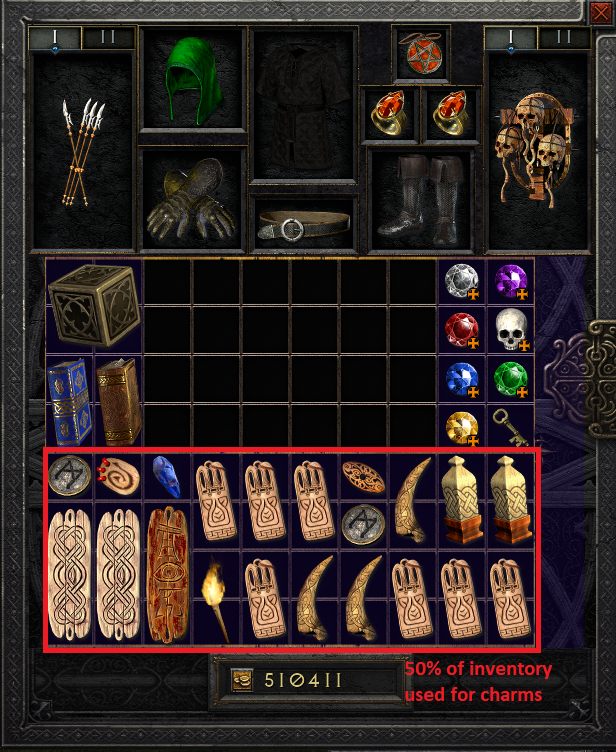
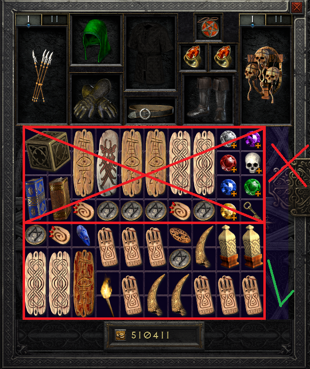

# BTDiablo

BTDiablo is a mod by [BTNeandertha1](https://www.twitch.tv/btneandertha1) for Diablo II Resurrected. As such, it is only to be used in Single Player.

- For all your BTDiablo needs please check our [wiki](https://btd.miraheze.org/).

## Game 
- More Challenging
- Built in Loot Filter
- Item Stacking!
- 3 Additional Shared Stash Tabs
- Negative 30 all resist (Only effects the Player)
- Negative 199 Magic Find (Level 90 Characters Start to Counter this effect)
- Start with nothing except Horadric Cube
- Horadric Cube is now 6x6
- Charm Inventory
- More Uber Key Bosses
- Insanity (was Hell) Difficulty is All Area Level 85 with 25% increased density!
- Additional Merc Gear
- Gold has a huge demand
- Crafting is very good
- Corruptions
- Endgame Farming Areas
- QOL improvements
- Endless Itemization... Literally
- Improved Melee
- Keep Wirt's Leg upon making the Secret Cow Level!
- Removed Act Cinematics
- Can now hold Multiple Unique Charms (Strictly for QOL not balance)
- Doubled Inventory! Only Top or Bottom Half Allowed (Strictly for QOL not balance)

BTNeandertha1 Social Media Links:  
- [Twitch](https://www.twitch.tv/btneandertha1)
- [YouTube](https://www.youtube.com/c/BTNeanderthal?sub_confirmation=1)
- [Twitter](https://twitter.com/BTNeandertha1)
- [Discord](https://discord.gg/BTNeandertha1)
- [Patreon](https://www.patreon.com/BTNeanderthal)

# Table of Contents
1. [How to Install](https://github.com/BTNeandertha1/BTDiablo#how-to-install)
2. [Bug Reporting](https://github.com/BTNeandertha1/BTDiablo#bug-reporting)
3. [Credits](https://github.com/BTNeandertha1/BTDiablo#credits)
4. [Future Ideas](https://github.com/BTNeandertha1/BTDiablo#future-ideas)
5. [Changes](https://github.com/BTNeandertha1/BTDiablo#changes)
   - [Game](https://github.com/BTNeandertha1/BTDiablo#game)
   - [Characters](https://github.com/BTNeandertha1/BTDiablo#characters)
   - [Shrines](https://github.com/BTNeandertha1/BTDiablo#shrines)
   - [Runewords](https://github.com/BTNeandertha1/BTDiablo#runewords)
   - [Runes](https://github.com/BTNeandertha1/BTDiablo#runes)
   - [Gems](https://github.com/BTNeandertha1/BTDiablo#gems)
   - [Items](https://github.com/BTNeandertha1/BTDiablo#items)
   - [Uniques](https://github.com/BTNeandertha1/BTDiablo#uniques)
   - [Sets](https://github.com/BTNeandertha1/BTDiablo#sets)
   - [Affixes](https://github.com/BTNeandertha1/BTDiablo#affixes)
   - [Crafting](https://github.com/BTNeandertha1/BTDiablo#crafting)
   - [Shop](https://github.com/BTNeandertha1/BTDiablo#shop)
   - [Recipes](https://github.com/BTNeandertha1/BTDiablo#recipes)
   - [Endgame](https://github.com/BTNeandertha1/BTDiablo#endgame)
   - [Corruptions](https://github.com/BTNeandertha1/BTDiablo#corruptions)
   - [Monsters](https://github.com/BTNeandertha1/BTDiablo#monsters)
   - [Elites](https://github.com/BTNeandertha1/BTDiablo#elites)
   - [Difficulties](https://github.com/BTNeandertha1/BTDiablo#)
      - [Pain](https://github.com/BTNeandertha1/BTDiablo#pain-was-normal)
      - [Agony](https://github.com/BTNeandertha1/BTDiablo#agony-was-nightmare)
      - [Insanity](https://github.com/BTNeandertha1/BTDiablo#insanity-was-hell)
   - [Area Changes](https://github.com/BTNeandertha1/BTDiablo#area-changes)
      - [Act 1](https://github.com/BTNeandertha1/BTDiablo#act-1)
      - [Act 2](https://github.com/BTNeandertha1/BTDiablo#act-2)
      - [Act 3](https://github.com/BTNeandertha1/BTDiablo#act-3)
      - [Act 4](https://github.com/BTNeandertha1/BTDiablo#act-4)
      - [Act 5](https://github.com/BTNeandertha1/BTDiablo#act-5)
   - [Skills](https://github.com/BTNeandertha1/BTDiablo#skills)
   - [Test Mode](https://github.com/BTNeandertha1/BTDiablo#test-mode)

# How to Install
Please follow BTN's [Install guide](https://rumble.com/v1ngrpk-how-to-install-my-new-diablo-2-resurrected-mod-btdiablo.html)

# Bug Reporting
Please use the [Issues](https://github.com/BTNeandertha1/BTDiablo/issues) section of GitHub or the [Discord Bug Reports](https://discord.gg/GUTuZHkzwz) channel!

# Credits 
- G1oomey Various testing, Bug Fixes and lots of help throughout the project
- Inspiration from ALL modders and Diablo Mods over the years  
- [HighTechLowIQ](https://www.youtube.com/c/HighTechLowIQ) on YouTube for educational Videos and some Files  
- MRCelSynap: For Helping with Corruptions and various modding  
- Elmegaard: Inspiration  
- Canight: Helped with a ton of ideas
- SenpaiSomething: Letting me look at PD2 Code
- Warren: Helping in the very beginning with Theory Crafting  
- Wolfieeiflow: Helping with Spreadsheets and brain power  
- JeyP: Testing things then walking me through  
- Kex: First Tester and first to Kill HC Hell Baal and help with Dev work
- Moved Qual-Kex closer to the portal for faster Revives
- Stackit (https://www.nexusmods.com/diablo2resurrected/mods/80) on Nexusmods to help with functionality of stacking!
- Stucifer "loot filter" display
- MrBrooksGaming Added UI Controller Support
- Bonesy for being an actual god and helping with a ton of various stuff! Check out their website (https://www.d2rmodding.com/)
- BaronBeefStick bug fixes and Dev work
- Precell and Wigglez for helping with Rune Drop Light Beams
- Wigglez huge help for adding panels and QOL to the mod
- JeyP with Map help and knowledge

# Future Ideas
Please see the [Future Ideas](https://github.com/BTNeandertha1/BTDiablo/issues/16) issue.  
Please submit your own ideas in the Future Ideas issue and they may be added later on!

# Patch Notes
**How do I get the new patch?**
1. **Delete btdiablo.mpq folder**
2. **Paste New btdiablo.mpq folder**

# Mod specific rules
1. Here are the rules for BTDiablo! Do not do the following, these things are not intended and not part of the balance of the game.
2. Larzuk Socketing Amulets, Rings, Gloves, Belts and Boots. You need to corrupt these items in order to get sockets to these items.
3. Utilizing Charms with more than half your inventory (Only Top or Bottom allowed)
4. Using Multiple Unique Charms of the same type (Example: 2x Hellfire, 2x Gheed or 2x Anni)
5. Selling and then buying back stacked currency from vendors
6. “Reorganizing" on controller to remove inventory debuffs
7. All of these exploits are possible due to prioritizing your QOL while being limited by softcode changes in D2R modding. 

## Charm inventory
- D2R provides limited modding capabilities, so some systems work by the word of honor.
  Here is a screenshot of how you should arrange your inventory, only utilizing the bottom(or top, if you want to).

- Here is an example of what you should not do. Do not use your full inventory to fill it with charms.

# Skills
- Skills that can now be cast in Shapeshift Forms
   - Taunt
   - Grim Ward
   - Shout
   - Battle Cry
   - Battle Orders
   - Battle Command

# Rifts
- Rift Cave Levels Changed to Nihlathak's Halls of Vaught (Nihlathak Only Spawns Once Per game choose wisely)
- Increased Drop Rates drastically to be a bit better than Cows
- Standard of Heros drop rate is ~Lum

# Terror Zones
- Terror Zones Simulate Players 20 (was 15)

## Characters
- Stamina is effectively removed as an attribute. All items granting stamina have had their stats changed.
- Walking has the same speed as running. You should always have your character walk to retain bonuses to block chance and defence.
- Greatly improved Attack Rating for all classes (All classes start with 750 AR, was -15 to 20)
- Doubled the Effect of Strength and Dexterity Bonuses on Weapons

## Shrines
- Made Gem Shrines Much more common. Stacked gems do not work with gem shrines, so if you want to upgrade a flawless gem to perfect, you need to have an **unstacked** flawless gem in your inventory in order to upgrade to perfect.
   - Removed: Armor, Stamina, Portal, Fire, Exploding, Poison
- Can now stack multiple shrines at the same time

## Runewords
- Enigma [Jah Ith Sol] (was Jah Ith Ber)
   - Added Flat Physical Damage Reduction
   - Removed Strength and % Damage Reduction
   - Half Magic Find% per level
- Spirit Shield [Mal Thul Ort Pul] (was Tal Thul Ort Amn)
   - Always Rolls 35% Faster Cast Rate
   - 25% Faster Hit Recovery (was 55%)
   - 1 to All Skills (was 2)
- Splendor [Eth Lum]
   - 20% Faster Cast Rate (was 10%)
- Added Soul Sword Runeword [Tal Thul Ort Amn] (was Spirit Sword, Spirit was changed)
   - +1 to Random Class (was +2 to all Skills)
   - 30% Faster Cast Rate (was 25-35 Faster Cast Rate)
   - 25% Faster Hit Recovery (was 55%)
- Holy Thunder [Eth Ral Ort Tal] works in any melee weapon (was Sceptors)
   - +100% Enhanced Damage (was 60) 
   - +15 Maximum Damage (was 10) 
   - Level 5 Holy Shock Aura when equipped (was +3 Holy Shock Paladin only)
   - Removed Chain Lighting Charges
- Honor [Amn El Ith Tir Sol]
   - Added +25 Increased Attack Speed
   - +160-190% Enhanced Damage (was 160) 
   - +20% Bonus Attack Rating (was 200 Flat Attack Rating)
   - Added 55% Faster Hit Recovery
   - Added Repairs Durability
   - Removed Replenish Life
- Malice [Ith El Eth]
   - Added 7% Life Stolen Per Hit
   - Added Repairs Durability
   - Removed Light Raidus
- Steel [Tir El] Melee Weapons (was sword, axe, mace)
   - Added 5% Chance of Crushing Blow on Hit
   - Changed Max and Min Damage to Flat Damage
   - Added Repairs Durability
- Strength [Amn Tir]
   - 90-110% Enhanced Damage (was 35)
   - Added Repairs Durability
- Prudence [Mal Tir]
   - 24 Magic Damage Reduction (was 17)
   - 8 PDR (was 3)
   - Added Cannot Be Frozen
   - Removed 1 Light Radius
- Lionheart [Hel Lum Fal]
   - 90-110% Enhanced Damage (was 20)
- Radiance [Nef Sol Ith]
   - 10 pdr (was 3)
   - Added 33 Life
   - Removed Enhanced Defense
- Nadir [Nef Tir]
   - 4 Magic Damage Reduction
   - 4 Physical Damage Reduction
   - Removed -33% Gold Find
- Black [Thul Io Nef]
   - 7 Magic Damage Reduction (was 2)
- Wealth [Lem Ko Tir]
   - Added 20 Faster Run/Walk
   - Added 10% Increased Attack Speed
   - 1 Magic Find% per Level (was 100)
- Delirium [Lem Ist Io]
   - Removed the Delirium Mod from Delirium (turned you into a doll "disabling your character")
- Zephyr [Ort Eth]
   - 25% Increased Attack Speed
   - Added 33% Pierce
   - 100% Enhanced Damage (was 33%)
   - 14% Chance to Cast level 2 Twister on striking (was 7% level 1 and when struck)
   - Added 30 Mana
- Edge [Tir Tal Amn]
   - Added 33% Pierce
   - 280-320% Enhanced Damage (was Demon and Undead Damage)
- Harmony [Tir Ith Sol Ko]
   - 275-325% Enhanced Damage (was 200-275)
- Wrath [Pul Lum Ber Mal]
   - Added 30% Increased Attack Speed
   - 300-375 Enhanced Damage (was Damage to Demons and Undead)
- Brand [Jah Lo Mal Gul]
   - Added 30% Increased Attack Speed
   - Removed Prevent Monster Heal
- Last Wish [Jah Mal Jah Sur Jah Ber]
   - Removed 20% Level 20 Charged Bolt on attack
   - Added Repairs Durability
- Grief [Eth Tir Gul Vex Ral]
   - Removed + Damage
   - Removed Venom
   - Added 300-350 Minimum Damage and Maximum Damage 
- Beast [Ber Tir Um Mal Lum]
   - Grizzly Charges Changed to oskill Hunger
- Insight Works in Spears [Ral Tir Tal Sol]
- Treachery [Shael Thul Lem]
   - 50% Fade Proc Chance (was 5%)
- Bone [Sol Amn Amn] (was Sol Um Um)
   - Replaced Bonespear on attack with 15-20% Faster Cast Rate
   - 15% all resist.
- Rain [Ort Dol Ith] (was Ort Mal Ith)
   - Replaced Twister on attack with 15-20% Faster Cast Rate
- Enlightenment [Pul Ral Sol]
   - Replaced Fireball on attack with 15-20% Faster Cast Rate 
- Myth [Hel Amn Nef]
   - Replaced Howl when struck to 20% Faster Run/Walk
- Principle [Ral Ko Eld] (was Ral Gul Eld)
- Call to Arms [Amn Ral Mal Ist Ohm]
   - Always Rolls 1 to Battle Orders, Battle Command, and Battle Cry
- Heart of the Oak [Ko Vex Pul Thul]
   - Removed Oak Sage Charges
- Dilemma [Dol Lem Mal] (New Armor)
   - +1 to Teleport
   - Drain Life 20 to 40
   - -25 to -35 Life After Each Kill
   - 35-50% Magic Find
   
## Runes
- Runes now have Stack mode and drop stacked from the world! (other than hard coded drops, ie. hellforge)
- Lem-Zod Now have a beam of light when they drop
- Eld Rune has 5 Replenish Life (was 15% Stamina Drain)
- Dol Rune has 2 Life After Each Kill for all slots
- Ist and higher Runes now all have 2% Experience Gained
- Cham Rune
   - Changed Armor and Helmet to 34% Reduced Curse Duration (was Cannot Be Frozen)
- Zod
   - Added +1 to All Skills

## Gems
- Gems now have Stack mode and drop stacked from the world! (other than hard coded drops, ie. hellforge)
- Chipped and Flawed Gems are replaced with standard gems (other than hard coded drops, ie. hellforge)
- Topaz Changed to Faster Run/Walk
   - Standard 10% Faster Run/Walk
   - Flawless 15% Faster Run/Walk 
   - Perfect 20% Faster Run/Walk

## Items
**Example** of item modifiers: Um in Weapon = 20 Open Wounds, Armor/Helm = 15 All resist, Shield = 22 All resist
- Arrows and Bolts can now have up to 3 sockets and be repaired
   - socketed items get Shield modifier
- All Weapons can now have the potential of 2 sockets
- Amulets and Rings can now have 1 socket
   - socketed items get Armor/Helm modifier
- Belts can now have up to 2 sockets
   - ilvl 1 = 1 Sockets, 49+ = 2 Sockets 
   - socketed items get Armor/Helm modifier
- Gloves and Boots can now have up to 3 Sockets
   - ilvl 1 = 1 Sockets, 49+ = 2 Socket, 75+ = 3 Sockets
   - socketed items in Gloves get Weapon modifier
   - socketed items in Boots get Armor/Helm modifier
- Throwing Weapons have up to 4 sockets
   - Socketed items get Weapon modifier
   - Throwing Axes can have up to 4 Sockets (Exceptional and Elite)
   - Javelins = 3 Sockets (Exceptional and Elite)
   - Throwing Spears can have up to 3 Sockets (Exceptional and Elite)
- Tulwar and Hydra Edge can now get 3 sockets (was 2)
- Annihilus
   - 10-15% Experience Gained (was 5-10%)
- Necro shields add 33% Pierce for the Teeth mechanic (was Poison Damage)
- Necro shields can now have 3 sockets
- Added Hellfire Ashes (Broken down Hellfire Torches) Torch + Larzuk's Forging Hammer 
- Tome of Town Portal, Identify and keys now stack up to 50
- All Essences now stack to 50
- Lidless Wall now rolls 1-2 Skills
- All Weapons have 50% increased base damage values**
   - Exceptional and Elite "BOWS" (NOT Crossbows) have 15% increased Maximum Base Damage instead**
- Added Neverfrost (Unique Jewel) [qlvl 78]
   - 1-3 Faster Cast Rate
   - 5-10 Increased Attack Speed
   - Cannot Be frozen
   - 2% Experience Gained
- Ogre Axe Now gets up to 5 Sockets
- Removed Faster Run/Walk Pentalty on Gear
- Removed Hit Causes Monster to Flee from everything except The face of horror
- Removed Light Radius all Unique and Set items (exception Hellfire Torch)
- Removed Indestructible From all Unique and Set items (exceptions Shadow Killer, Ethereal Edge and Ghost Flame)
- Removed Stamina from all Unique and Set items
- Brick (earn 1 each time you destroy an item for corruptions)
- Flask of Etheric Light (Created by cubing 100 Standard of Heros) **WARNING DO NOT TRY RECIPE IF ITEM IS ZODDED**
- Turn ANY Item Ethereal including sets and Corruptions! (does not work on BOWS)
- The Divine Standard (Created by cubing 100 Bricks) Infinite Corruption Item
   
## Uniques
- All Amplify Damage Procs for Unique Items spawn with at least 20% chance to Cast
- Cranium Basher
   - 60 Increased Attack Speed
   - 30% Level 10 Amplify Damage
   - Repair Durability
   - 25-30 Strength (was 25)
   - 25-35 All Resistances (was 25)
   - 250-300%
   - added skill on kill 100% chance Lvl 50 Twister
   - added 20-50 -requirements
   - added Lifesteal 4-6
- Mang's Song Lesson
   - 85 Faster Cast Rate
   - 6 All Skills
   - 20-25 Cold Fire Light Pierce
   - 40-50 All resist
   - 30 Regen Mana
   - 40% Increased Maximum Mana
- Executioner's Justice
   - Level 8 Decrepify on striking instead
   - 50% Crushing Blow
   - 50% Deadly Strike
   - 280-340% Enhanced Damage (was 240-290)
   - -50% Target Defense (was 33)
   - 50% Increased Attack Speed (was 30)
   - added Manasteal 4-6
   - added skill on hit 60% chance Lvl 40 FoH
   - added oskil Zeal
   - added slows target 20%
- Tyreal's Might
   - Lower Level Requirement
   - +2 to All Skills
   - 1 to Teleport
   - 45% Faster Run/Walk
   - 200-250 Damage to Demons
   - 200-250 Damage to Undead
   - Removed Slain Monsters Rest in Peace
- Shadow Dancer's
   - 1-2 Traps, Shadow Disciplins, Martial Arts
   - 40 Faster Run/Walk
- Waterwalk
   - 40 Faster Run/Walk
- Ghostflame
   - 4 Fire Skills
   - 30 Faster Cast Rate
   - 5-10 Fire Pierce
   - 5-10 Fire Skill Damage
   - 5 Maximum Fire resist
   - Removed
   - Ignore Targets Defense
   - Enhanced Damage
   - Mana Steal
- Steelrends
   - 70-100 ED
   - 15-20 Deadly Strike
   - 15 Crushing blow
   - -30 to 40 Requirements
   - Changed defense 170-210 to defense % 100-150
   - 20-25 Strength (was 15-20)
- Earth Shifter
   - 60 Faster Cast Rate
   - 60 Increased Attack Speed
   - skill on hit Volcano 50% chance Lvl 50 (was Fissure)
   - 35% crushing blow (was 33)
   - 6% Mana steal
   - 30-50 -requirements
   - skill on hit Lower resist 10% chance Lvl 5
- Schaefer's Hammer
   - Level 20 Static Field
   - 200-230 ED
   - 60% Increased Attack Speed
   - Repairs Durability
- Stone Crusher
   - 40% Increased Attack Speed
   - 300-320 Enhanced Damage (was 280-320)
   - Target defense -50% (was 25%)
   - Flat Damage increased 42-69 (was 10-30)
- Death Cleaver
   - 250-330 Enhanced Damage (was 230-280)
   - Target defense -50% (was 33%)
   - added crushing blow 10-15%
- Steel Shade
   - Replenish Life 30-50
   - 2 Skills 
   - 20% FBR
   - 20% Increased Block
- Gargoyle's Bite (required Level 80 was 70)
   - -20-25% Poison Pierce
   - 250-350% Enhanced Damage (was 180-330)
   - 3-4 Plauge Jav + 3-4 Poison Jav
   - poison skills 1-3
   - 30 Increased Attack Speed
   - 11-15 Lifesteal (was 9-15)
- Stormlash
   - Level 20 Static Field
   - 269-300% Enhanced Damage (was 240)
- The Oculus 
   - 5% Chance to cast Teleport
- Stormspire
   - 8-10 Lifesteal
   - 30% Level 10 Lower Resist on striking
   - 200-300 ED
   - 20 Strength
   - 150% Bonus Attack Rating
- Demonhorn's Edge
   - 3-4 Warcries, Combat Skills, Masteries
   - 20 Attack Speed
   - 100-150 Damage to Demons
- Wolfhowl
   - Oskill Dire Wolves
   - 10-15 Strength (was 8-15)
   - 10-15 defense (was 8-15)
   - 10 Vitality	(was 8-15)
   - 4-6 Werewolf (was 3-6)
   - 4-6 Lycanthropy (was 3-6)
   - 4-6 Feral Rage (was 3-6)
   - 4-6 Fury
- Halaberd's Reign
   - 2-3 Barbarian Skills
   - 15 Life Per Kill instead of Rep Life
   - 10-15% Damage Reduction
- Astreon's Iron Ward
   - Added Ignore Target's Defense
   - 250-300 Enhanced Damage (was 240-290)
   - Added 3 All Skills 
   - 1-2 Combat Skills Paladin Only (was 2-4)
   - 60-85 + Damage (was 40-85)
   - Added 40% Faster Cast Rate
   - Added 40% Increased Attack Speed
- Head Hunter's Glory
   - 15-25 All resist instead
   - 10-15 Life Per Kill
   - 25 Faster Run/Walk
- Medusa's Gaze
   - 20% Level 10 Decrep When Struck
   - 40% Slow Targets
   - -30% Requirements
- Spirit Ward
   - 2 to class skill
   - 35% CTC Fade when Struck
   - -30 Requirements
- Steel Pillar
   - Repair Durability
   - 280-350 Enhanced Damage (was 210-260)
   - 30-40% Increased Attack Speed (was 25)
   - -66% Target Defense (was 20)
   - added Lifesteal 7-12
   - added Deadly Strike 10-20
   - removed Defense % 50-80
   - crushing blow	33-44 (was 25)
- Ondal's Wisdom
   - 85% Faster Cast Rate
   - 5-15% Experience Gained
- Azurewrath
   - Holy Freeze instead
   - 2 Skills
- Grandfather
   - 200-300
   - Repairs Durability
- Frostwind
   - Added 20% CTC Level 10 Lower resist on Striking
   - Added 20% CTC Level 20 Frozen Orb on Striking
   - Added -30% Enemy Cold Resistance
- Doombringer
   - Repair Durability
- Boneshade
   - 30 Faster Cast Rate
- Darkforce Spawn
   - 2-3 Curses, Summon, Bone Skills
   - +5 to Bone Spear, Teeth, Bone Spirit, Bone Armor
   - 50% Pierce
- Boneflame
   - 50% Pierce
   - 3-5 Vigor 
   - Remove Run/Walk
- Homunculus
   - 50% Pierce
- Blood Raven's Charge
   - 3-5 Bow Skills
   - 30 Increased Attack Speed
- Dragon Scale
   - Fire Mastry
   - 30 Faster Cast Rate
- Alma Negra
   - Level 1 Salvation
   - 100-300% ED 
   - 75-150% Attack Rating
- Carrion Wind
   - 100 Poison Length Reduction
   - Poison Nova on Striking
   - 150-250 Attack Rating
   - 40% Damage taken goes to mana
- Nature's Peace
   - 5 to Oak
   - 20% Open Wounds
- Wisp Projecter
   - 1 to Heart of Wolverine
   - Remove Oak and Spirit of barbs charges
- Atma's Scarab
   - 10% Level 3 Amp
- Metalgrid
   - 20 to Iron golem, Summon Resist, and Golem Mastery
- Seraph's Hymn
   - 50-100 Damage to Demons
   - 50-100 Damage to Undead
- Cerebus Bite
   - 3-4 Shape Shifting
- Spirit Keeper
   - 3-4 Summoning
- Firelizard's Talons
   - 2-3 Martial Arts
   - 4 Wake of Fire and Inferno + 4 Death Sentry
   - 250-290 Enhanced Damage (was 200-270)
   - 20 Increased Attack Speed (was 15%)
   - Removed Fire Resist
   - added Fire pierce 8-10%
- Jade Talon
   - 3-4 Shadow and Martial Art Skills
   - 1 to Dragon Flight
- Shadow Killer
   - 3-5 Shadow Disciplins
   - 20 Increased Attack Speed
   - Ignore Target's Defense
   - 3 to Blade Shield
   - Removed Frost Nova and Freeze Target
- Arkaine's Valor
   - Always 2 Skills
   - -20% Requirements
- Spike Thorn
   - Removed Sockets
   - Added 40-65 Damage
   - Added -30 Requirements
- Rune Master
   - Removed Sockets
   - 270-320 Increased Enhanced Damage (was 220-270 ED)
   - Added Ignore Target's Defense
   - Added 20% Increased Attack Speed
- Black Hades
   - Removed Sockets
   - Cannot Be Frozen (was Half Freeze Duration)
   - 180%-220% Damage to Demons (was 30%-60%)
- Spirit Forge
   - Removed Sockets
   - 100 Life (was 10 Life/Level)
   - 50-70 Damage (was 20-65 Fire Damage)
   - 15-20 Strength (was 15)
- Witchwild String
   - Removed Sockets
   - Added 20% Increased Attack Speed
   - 20% Chance to Cast Level 22 Amplify Damage on Striking (was 2% level 5)
- Hellrack
   - Removed Sockets
   - 30 Increased Attack Speed (was 20)
   - 400 Elemental Damage (was 63-324)
   - Added 20% Chance to Cast Level 10 Lower Resist On Striking
- Crown of Ages
   - Removed Sockets
   - Repairs Durability 5 (was Indestructible)
   - Added 12-15 Magic Damage Reduced
   - Added 7-9 Life After Each Kill
- Leviathan
   - Repairs Durability 5 (was Indestructible)
   - 200-220 Enhanced Defense (was 170-200)
   - +169 Defense (was 100-150)
   - 20-25% Damage Reduction (was 15-25)
   - 20 Faster Run/Walk
   - 30 Faster Hit Recovery
   - 100 Poison Length Reduction
   - 5-10% Maximum Life
   - 20-30 Deadly strike
- Ormus Robe
   - 30% Faster Cast Rate (was 20)
   - added 10-15% Fire/Cold/Light
   - added 100-120 Enhanced Defense
   - added 5-8 Mana After Each Kill
   - added 5-8% Maximum Mana
   - added 40-69 Life
- Gladiators Bane
   - 150% Enhanced Defense (was 150-200)
   - 20-30 Magic Damage Reduced (was 15-20)
   - 20-30 Physical Damage Reduced (was 15-20)
   - 125 Poison Length Reduction (was 50)
   - 50 Faster Hit Recovery (was 30)
   - always Ethereal
   - added 40-50 Life
   - 10 Faster Run/Walk
   - removed thorns 20
   - removed repairs durability
   - removed Defense 50
- Guardian Angel
   - +1 all skills
   - +1 to Paladin Skills Changed to Random Class Skills
   - 200-220 Enhanced Defense (was 180-200)
   - 35 Block rate(was 30)
   - 30 Block chance(was 20)
   - -30 to -40 requirements
   - removed Attack Rating vs Demon per level
- Toothrow
   - 10-20 Strength (was 10)
   - 40-50% open wounds (was 40)
   - 30-40% Fire resist (was 15)
   - 200-240% Enhanced Defense (was 160-220)
   - 10% deadly strike
   - 40 Life
   - 90-120% Enhanced Damage
   - 30% Faster Hit Recovery 
   - removed 40-60 defense
   - removed thorns
   - removed repairs durability
- Atmas Wail
   - 40% Faster Hit Recovery (was 30)
   - 150-180% Enhanced Defense (was 120-160)
   - 20-30 Energy
   - Mana regen 50
   - 1.25 Mana per level
   - 25 Faster Cast Rate
   - 0.75 Magic Find per level
   - -30% requirements
   - +15 Telekinesis
   - removed Dexterity
   - removed replenish Life
   - removed defense per level
   - removed Repair Durability
   - removed Base Magic Find
- Que Hegans Wisdom
   - 25 Faster Cast Rate (was 20)
   - 5 Mana after each kill (was 3)
   - 10-16 Magic Damage Reduced (was 6-10)
   - 20 Energy (was 15)
   - 40 Faster Hit Recovery	(was 20)
   - 150-180 Enhanced Defense (was 140-160)
   - +3 Lower Resist oskill
   - 5-10 Vitality
   - half freeze duration
- Templars Might
   - 4-6 Offensive Auras
   - Level 6 Conviction Aura when equipped 
   - 20-30 Strength
   - 180-230% Enhanced Defense (was 170-220)
   - 24-30 Faster Hit Recovery (was 20)
   - 30-40 Life
   - -50% Requirements
   - 75 Poison Length Reduction
   - Removed 20-30 Vitality
- Ironpelt
   - Level 15 Defiance aura when equipped
   - 100 Enhanced Defense (was	50-100)
   - 16-20 Magic Damage Reduced (was 10-16)
   - 5-10% Maximum Life
   - 10-20 Dexterity
   - 1.25 Life per char level
   - +3-5 oskill Ironskin
   - removed Life 
   - removed Flat Physical Damage Reduced
   - removed defense per char level 
   - removed repairs durability
- Duriels Shell
   - 180-220 Enhanced Defense (was	160-200)	
   - 20 Faster Hit Recovery   
   - 15-20 Strength (was 15)
   - 40 fire resist (was 20)
   - 40 lightning resist (was 20)
   - 40 poison resist (was 20)
   - 60 cold resist (was 50)
   - 1.5 life per level (was 1)
   - removed defense per lvl
- Shaftstop
   - 200-250 Enhanced Defense (was 80-220)
   - 25-30% Damage Reduced (was 30)
   - 85-140 Life (was 60)
   - 6-12 Damage Reduced 
   - 250 defense vs melee
   - 125-150% Damage to Demon
   - 125-150% Damage to Undead
- Heavenly Garb
   - 150% Enhanced Defense (was 100)
   - 15-30% all resist (was 10)
   - 20 Energy (was 15)
   - 125-150DMG Undead (was 50)
   - 3-5 Mana After Each Kill
   - 125-150% Damage to Demon
   - added Hits Blinds Target
   - added half freeze duration
   - added 10% Experience Gained 
   - removed mana regen
   - removed Attack Rating to Undead
- The Spirit Shroud
   - 11-15 Magic Damage Reduced (was 7-11)
   - 180% Enhanced Defense (was 150)
   - 50-69 Mana
   - 25 Faster Cast Rate
   - 10-15 Energy
   - 20 Faster Hit Recovery
   - removed Replenish Life
- Skin of the Flayed one
   - 8-12 Lifesteal (was 5-7)
   - 160-200 Enhanced Defense (was 150-190)
   - -50 Monster defense per hit
   - added prevent monster heal
   - 25-50 Damage
   - 35-45 Life
   - 20 Increased Attack Speed
   - 10 Faster Hit Recovery
   - +1 random class skill
   - removed repair durability
   - removed replenish Life
   - removed thorns
- Crow Caw
   - 50 open wounds (was 35)
   - 150-200 Enhanced Defense (was 150-180)
   - 15-25 defense (was 15)
   - 20 Faster Hit Recovery (was 15%)
   - 30 Increased Attack Speed (was 15%)
   - 20% Crushing Blow
   - 4-8 lifesteal 
- Greyform 
   - 10 Magic Damage Reduced (was 3)
   - 25-30 cold resist (was 20)
   - 25-30 fire resist (was 20)
   - 9 lifesteal (was 5)
   - 30 Life
   - 10-15 Strength
   - removed dexterity
   - removed defense 
- Blinkbats Form
   - 100 defense vs missile (was 50)
   - 30 Faster Run/Walk (was 10)
   - 3-5 Mana After Each Kill
   - 25 Life
   - 25 Mana
   - removed defense
   - removed Fire Damage
- Darkglow
   - 5-10 maximum all resist (was 5)
   - 100 DefenseMelee (was 50)
   - 10-15 all resist (was 10)
   - 100-150 Enhanced Defense (was 70-100)
   - 20 Life
   - 6-10 Physical Damage Reduced 
   - removed Attack Rating 
- The Centurion
   - 6 Physical Damage Reduced (was 2)
   - 50 Life (was 30)
   - 50 Mana (was 30)
   - 25 Mana regen (was 10)
   - 30 Faster Hit Recovery
   - removed defense
- Hawkmail
   - 100-120% Enhanced Defense (was	80-100)
   - 20 max cold resist	(was 15)
   - 40 cold resist (was 15)
   - 25 Faster Run/Walk (was 10)
   - 20 Faster Hit Recovery
   - 20 Increased Attack Speed
- Twitchthroe
   - 25 Increased Attack Speed (was 20)
   - 10-20 defense (was 10)
   - 40 Block chance (was 25)
   - 30 defense (was 25)
   - 10-20 Strength (was 10)
   - 6-9 Magic Damage Reduction
   - 25-36 Pierce
- Venom Ward
   - 20% max poison resist	(was 15)
   - 175% Poison Length Reduction (was 50)
   - 30-70% Poison resist (was 90)
   - 100-140% Enhanced Defense (was 60-100)
   - 6 Physical Damage Reduced
   - 4-10% Poison Pierce
   - +1-2 Poison Skills
- Sparking Mail
   - 100-120% Enhanced defense (was 75-85)
   - 1-69 Lightning Damage (was	1-20)
   - 10-15 Lightning Absorb (was 10-14 Lightning thorns)
   - 50% lightning resist (was 30)
   - 100% gold find
   - 30-40 Mana
   - -20 Requirements
   - +1-2 lightning skills 
- Iceblink
   - Cannot Be Frozen (was half freeze duration)
   - 30-50% cold resist (was 30)
   - 6-9 Magic Damage Reduction (was 1)
   - 100-130% Enhanced defense (was 70-80)
   - Cold Damage 25-50
   - 50 Mana
   - -25 Requirements
   - 10-20 cold Absorb
   - 10% Faster Run/Walk
   - +1-2 Cold Skills
- Boneflesh
   - 6-9 Lifesteal (was 5)
   - 100-150% Enhanced Defense(was 100-120)
   - 50 Life (was 35 Attack Rating)
   - 30-40 open wounds (was 25)
   - 8-12 Vitality
   - 20% Increased Attack Speed
   - 15% Faster Run/Walk
   - -20 to -30 requirements
   - 30-40 Enhanced Damage%
   - 20-30 Pierce
- Goldskin
   - 150-200% Enhanced Defense(was	120-150)
   - 35-45% all resist (was 35)
   - 7-12 Magic Damage Reduction (was 10 thorns)
   - 200-250 Gold Find(was 100)
   - 20-40 Magic Find
   - -10 to -20 Faster Run/Walk 20-10
   - -20 to -40 requirements
   - 12-24 Faster Hit Recovery 12-24
- Silks of the Victor
   - 5-8 Mana After Each Kill (was 5 Manasteal)
   - 120-150% Enhanced Defense (was 100-120)
   - 5-8 Life After Each Kill
   - 10 Faster Cast Rate
   - 10 Increased Attack Speed
   - +1 Cold skills
   - +1 Fire Skills
   - +1 Light Skills
   - +1 Poison Skills
   - -40 to -50 requirements
- Rockfleece
   - - 20 requirements (was -10)
   - 100-169% Enhanced Defense (was 100-130)
   - 15-20% Physical Damage Reduction (was 10)
   - 12-15 Physical Damage Reduced (was 5)
   - 15-20 Strength (was 5)
   - 20% Faster Hit Recovery
   - 30 Life
   - 15% Faster Run/Walk
- Rattlecage
   - Level 10 Blessed Aim Aura when equipped
   - 35-40% Crushing blow (was 25)
   - 200% Enhanced Defense (was 200 defense)
   - removed Attack Rating 
   - 15-20 deadly strike
   - 10-15 Strength 10-15
   - -40 requirements
- Giant Skull
   - Removed Sockets 
   - Removed Knockback 
   - 25% Crushing Blow (was 10%)
   - Added 30-60% Enhanched Damage
   - Added 12-21 Flat Physical Damage Reduction
   - Added 25-35 Dexterity
- Bonehew
   - Removed Sockets
   - 50% Chance to Cast Level 40 Bonespear (was Level 16)
   - Added 7% Life Leech
- Tomb Reaver
   - Removed Sockets
   - Added Level 7-9 Fanatacism Aura when Equipped
- Heaven's Light
   - Removed Sockets
   - 300-350 Enhanced Damage (was 250-300)
   - Always 3 Paladin Skills (was 2-3)
   - -66% Target Defense (was 33)
   - 15-20 Life after Kill (was life after Demon Kill)
- Headhunter's Glory
   - Removed Sockets
   - Added 50% Faster Run/Walk
   - Added 40% Increased Attack Speed
   - Added Cannot Be Frozen
   - Added Hit Blinds Target
- Moser's Blessed Circle
   - 55% Increased Block Chance
   - 60% Faster Block Rate
   - 40 All Resistances (was 25)   
- Hone Sundan
   - Always Ethereal
   - 200-250% Enhanced Damage (was 160-200)
   - adds 40 Damage was (20-40)
   - Added 80 Increased Attack Speed
   - Removed Sockets
- Stone Raven
   - 269-300 Enhanced Damage (was 230-280)
   - 101-300 Magic Damage (was 101-187)
   - 40-50 All Resistance (was 30-50)
   - 2-4 Javelin and Spear Skills (was 1-3)
- Windhammer
   - 40% Chance to Cast Level 33 Twister on striking (was 33% level 22)
- Blade of Ali Baba
   - Removed Sockets
   - Added 150% Gold Find
- The Patriarch
   - 250% Gold Find (was 100)
   - Added 50% Faster Cast Rate
   - 6 Magic and Physical Damage Reduction (was 3)
- Djinn Slayer
   - Removed Sockets And Reworked
   - 300-400% Damage to Demons
   - 500 Magic Damage
   - 200-300 Attack Rating against Demons
   - Level 7-9 Redemption Aura when Equipped
   - 25% Crushing Blow
   - 20% Increased Attack Speed
- Eschuta's Temper
   - 2-3 Sorceress Skills (was 1-3)
   - -5 to -15 To enemy Fire and Lightning Resistance (was 10-20 Fire and Lightning Skill Damage)
- Axe of Fechmar
   - Removed Light Radius
   - Added 20% Increased Attack Speed
- Steeldriver
   - Removed Stamina
   - 25 Life 
- The Centurion
   - Removed Stamina
   - 30 Life (was 15)
   - 30 Mana (was 15)
   - Added 10 Life Regen
   - Added 10% Mana Regen
- Treads of Cthon
   - Removed Stamina
   - 20 Life (was 10)  
- Zakarum's Hand
   - Removed Stamina
   - 15 Replenish Life
- Rainbow Facets
   - Roll 4-5 (was 3-5)
- Steel Carapace
   - 30-40% Damage Reduction
   - 15% Faster Run/Walk
- Death's Fathom
   - 40% Faster Cast Rate (was 20)
   - Added -10 to -20% Enemy Cold Resistance
- Nightwings
   - 8-12% Cold Skill Damage
   - -8% to -12% Enemy Cold Resistance
- Wraith Flight
   - 200-260% Enhanced Damage (was 150-190)
   - 10-15 Lifesteal (was 9-13)
   - 20 Increased Attack Speed
   - crushing blow 10
   - slows target 15
- Demons Arch
   - 200-230% Enhanced Damage (was 160-210)
   - Life on each Kill 9-12 (was Lifesteal)
   - 255-420 Cold Damage
   - 255-420 Fire Damage (was 232-323)
   - 63-420 Lightning Damage (was 23-333)
   - 8-15 pierce Fire/Cold/Light pierce
   - -20% Requirements
- Lacerator
   - 240-280 Enhanced Damage (was 150-210)
- Deathbit
   - 50% Deadly Strike (was 40)
   - 200-269% Enhanced Damage (was 130-180)
   - added -50% Target Defense
   - added Hits Blinds Targets
   - 30% Increased Attack Speed
- The Scalper
   - 200-269% Enhanced Damage (was 150-200)
   - 50% Bonus Attack Rating (was 25)
   - 30 Increased Attack Speed (was 20)
   - 35% open wounds (was 33)
   - 6-9 Lifesteal (was 4-6)
   - Added Prevent Monster Heal
   - 20 Faster Run/Walk
- Gimmershred
   - 200-230% Enhanced Damage (was 160-210)
   - 250-500 Fire Damage (was 218-483)
   - 250-500 Cold Damage (was 176-397)
   - 61-501 Lightning Damage (was 29-501)
   - added 20% chance to cast Level 6 Lower Resist
- Warshrike
   - 269-320 Enhanced Damage (was 200-250)
   - 40% Chance to cast LEVEL 20 Nova on hit (was 25% LVL 9)
- Kuko Shakaku 
   - Added 2-3 Exploding Arrow
   - 2-3 Immolation Arrow
   - 20% Increased Attack Speed
- Eaglehorn
   - 2 Amazon Skills (was 1)
   - Added + 7 to Valkyrie
- Hellfire Torch
   - Removed Firestorm on Striking

## Sets
- Ondal's Almighty
   - 2 to Skills
   - 10 Faster Cast Rate
- Taebaek's Glory
   - 40 Faster Cast Rate
- Laying of Hands
   - 150-200 Damage to Demons (was 350%)
- Sazabi's Sword
   - 250 ED
- Vidala's Fetlock
   - 10 Vitality (was Stamina)
- Tancred's Hobnails
   - 25 Life (was Stamina)
- Rite of Passage
   - Cannot Be Frozen (was Half Freeze Duration)
   - 15-25 Life 
   
Aldur's Watchtower (Full Set)
   - Removed Defense
   - 100 Magic Find 3 Pieces (was 50) 
   - Added 20% Physical Damage Reduction with full set
   - Added + 7 Grizzly
- Aldur's Rhythm (Weapon)
   - Removed Sockets
   - 300 Enhanced Damage (was 200 Damage to Demons)
   - 45 Increased Attack Speed (was 30)
- Aldur's Stoney Gaze (Helm)
   - Removed Sockets and Light Radius
   - 75 Mana (was Regen 17% Mana)
   - 1-2 All Skills (was Druid Skills)
   - Added 40-50 Lightning Resist
- Aldur's Deception (Armor)
   - 2-3 All Skill Tabs (was 1-2 Druid Skills)
   - 20-30 Strength (was 20)
   - 15-25 Dexterity (was 15)
   - Added 50 Life
- Aldur's Advance (Boots)
   - Removed Stamina
   - Added 10 Life Regen
   - Added 10% Mana Regen
Griswold's Legacy (Full Set)
   - Removed Flat Attack Rating
   - Added 40 Faster Run/Walk (3 Items)
   - Added + 7 Holy Shield
   - Added 300 Enhanced Damage
   - Added 25% Physical Damage Reduction
- Griswold's Heart (Armor)
   - Removed Sockets
   - 1-3 All Skill Tabs (was 1-2 Paladin Skills)
   - 20-30 Strength (was 20)
   - 600 Defense (was 500)
   - Added 6-9 Mana After Each Kill
   2 Items = 2 To Defensive Skills
   3 Items = 27% Increased Maximum Life
   4 Items = 5% Increased Maximum Lightning Resistance
- Griswold's Valor (Helmet)
   - Removed Sockets
   - 25% All Resistance (was 5%)
   - 1-2 All Skills
   - .33% Deadly Strike Based On Character Level
   - 100% Poison Length Reduction
   2 Items = 2 to Offensive Aura
   3 Items = 15% Mana Stolen Per Hit
   4 Items = 5% Increased Maximum Poison Resistance
- Griswold's Redemption (Weapon)
   - Removed Sockets and Damage to Demons
   - 300-350% Enhanced Damage (was 200-240)
   - 60% Increased Attack Speed (was 40%)
   - Added +190 to 250 Damage
   - -50% to Target Defense
   - 15% Chance to Cast Level 5 Frost Nova
   2 Items = 2 to Combat Skills
   3 Items = 15% Life Stolen Per Hit
   4 Items = 5% Increased Maximum Cold Resistance
- Griswold's Honor (Shield)
   - Removed Sockets
   - Added 45% Faster Cast Rate
   - Added 3 All Skills 
   - 60% Increased Block Chance (was 20)
   - 20-30 Flat Physical and Magic Damage Reduction
   - 150-200 Enhanced Defense
   2 Items = 15 Strength
   3 Items = 25% Faster Hit Recovery
   4 Items = 5% Increased Maximum Fire Resistance

Immortal King (Full Set)
   - Added 100% Magic Find
   - Added 300% Enhanced Damage
   - 30 Magic Damage Reduction (was 10)
   - Added + 7 Item Find
- Immortal King's Will (Helm)
   - 30-45 Magic Find (25-40)
   - 40-50 Gold Find (was 37)
   - 1-3 Warcries (was 2)
   - Added 30 Fire Resistance
   - 2 Items = 15 Energy
   - 3 Items = 15 Vitality
   - 4 Items = 15 Strength
   - 5 Items = 15 Dexterity
   - 6 Items = 20 Faster Cast Rate
- Immortal King Stone Crusher (Weapon)
   - 250-300% Enhanced Damage (was 200)
   - 250% Damage to Demons and Undead (was 200)
   - Added -40% requirements
   - Added 2 to Combat Materies
   - 4 Items = Poison Damage (was Cold)
   - 5 Items = Magic Damage (was Poison)
   - 6 Items = + 250 Damage (was Magic Damage)
- Immortal King's Detail (Belt)
   - 2 Items = 30% Physical Damage Reduction
- Immortal King's Soul Cage (Armor)
   - 20% Chance to Cast Level 5 Enchant (was 5% Chance)
- Immortal King's Pillar (Boots)
   - Added 3-5% Physical Damage Reduction
   - Added 30-40% Magic Resistance
   - 10-15 Vitality (was 44 life)
   - 6 Items = 15 Strength
- Immortal King's Forge (Gloves)
   - 12% Chance to Cast Level 20 Static Field when Struck (was level 4 Charge Bolt)
   - 6 Items = 34% Curse Reduction
   
Natalya's Odium (Full Set)
   - Removed Defense
   - Magic Damage Reduced by 30 (was 15)
   - Added 100% Magic Find
   - Added +7 to Phoenix Strike
- Natalya's Shadow
   - Removed Sockets
   - 500-600 Defense (was 150-225)
   - 1-1.5 Life Based on Char level (was 1per level)
   - 1-3 All Skill Tabs (was 1-2 Assassin Skills)
   - 75-150 Poison Length Reduction
- Natalya's Soul (Boots)
   - Removed Stamina and Durability
   - Added 3-5 Pierce All
- Natalya's Totem (Helm)
   - Added 1-2 All Skills
- Natalya's Mark (Weapon)
   - 2 All Skills
   - 100 Cold Damage (was 50)
   - 100 Fire Damage (was 12-17)
   
Bul-Kathos' Children (Full Set)
   - 4 All Skills (was 2)
   - +100 Damage
   - 300% Enhanced Damage (was 200 demons and undead)
   - Removed Deadly Strike
   - 20% Physical Damage Reduction
   - Added 50% All resistances
   - Added 100% Magic Find
- Bul-Kathos' Sacred Charge
   - Removed Sockets
   - 200-250 Enhanced Damage (was 200)
   - 10-20 All Resistances (was 20)
   - Added Hit Blinds Target
   - Added 20-30 Dexterity
   - Added 5% Mana Stolen Per Hit
- Bul-Kathos' Tribal Guardian
   - Removed Sockets
   - 200-250 Enhanced Damage (was 200)
   - 10-20 All Resistances (was 50 Fire resist)
   - 20% Chance to Cast Level 10 Poison Nova on Striking (was 50 poison damage)
   - Added 20-30 Strength
   - Added 5% Life Stolen Per Hit
   - Added 15% Chance to Open Wounds
   
M'avina's Battle Hymn (Full Set)
   - Removed Defense
   - Added 40 Faster Run/Walk
   - Added - 50% Enemy Cold Resistance
   - Added 10 Mana After Each Kill
   - Added + 7 Valkyrie
M'avina's Icy Clutch (Gloves)
   - +100 Cold Damage (was 6-18)
   - Cannot Be Frozen (was Half Freeze Duration)
   - 100-150% Gold Find
   - 20-30 Dexterity and Strength
   - 2 Items = 15 Vitality
   - 3 Items = 25 Increased Attack Speed
   - 4 Items = 20% Cold Pierce
   - 5 Items = 20% Cold Skill Damage
M'avina's True Sight (Helm)
   - 2 Items = 2 All Skills (was 1)
   - 5 Items = 5% Maximum Cold Resistance
M'avina's Embrace (Armor)
   - 2-3 All Skill Tabs (was 1-2 Amazon Skills)
   - 2 Items = 15 Energy
   - 3 Items = 30% Faster Hit Recovery
   - 4 Items = 20% Physical Damage Reduction
   - 5 Items = 5% Maximum Fire Resistance
M'avina's Caster (Weapon)
   - Added 4-5 Bow and Cross Bow Skills
   - 34% Chance to Pierce
   - 2 Items = 15 Dexterity
   - 3 Items = 114-377 Magic Damage
   - 4 Items = 2 Bow and Crossbow Skills
   - 5 Items = 5% Maximum Lightning Resistance
M'avina's Tenet (Belt)
   - 30 Faster Run/Walk (was 20)  
   - Added 10-15 All Resistances
   - Added 3-5 Mana After Each Kill
   - 2 Items = 20% Fire Pierce
   - 3 Items = 15 Strength
   - 4 Items = 25% All Resistances
   - 5 Items = 5% Maximum Poison Resistance
   
Trang-Oul's Avatar (Full Set) Full Set no longer turns you into a Goul
   - Added + 7 Lower Resist
- Trang-Oul's Guise (Helm)
   - Defense 100
   - Faster Hit Recovery 25
   - Level 15 Thorns When Equipped
   - +2 to Summon Skills (Druid and Necromancer)
   - +2 to all Skills
   - 2 Items = 15 Energy
   - 3 Items = 25% Fire Pierce
   - 4 Items = 15 Dexterity
   - 5 Items = 5% Maximum Lightning Resistance
- Trang-Oul's Scales (Armor)
   - -40% Requirements
   - 30% Faster Hit Recovery
   - 1-3 All Skilltabs (was 1-2 Necromancer Skills)
   - 150% Enhanced Defense
   - 2 Items = 15 Strength
   - 3 Items = 50% Lightning Resistance
   - 4 Items = 15 Vitality 
   - 5 Items = 25% Physical Damage Reduction
- Trang-Oul's Wing (Shield)
   - 125 Defense
   - 20-30 Dexterity and Strength
   - 35-50 Fire Resistance
   - 30% Chance to Block
   - 40% Poison Resistance
   - +2 to Poison and Bone Skills
   - 35% Faster Cast Rate
   - 2 Items = 35% Faster Block Rate
   - 3 Items = 25% Poison Pierce
   - 4 Items = 15 Strength
   - 5 Items = 5% Maximum Fire Resistance
- Trang-Oul's Claws (Gloves)
   - 2 Items = 15 Dexterity
   - 3 Items = 15 Energy
   - 4 Items = 25% Poison Skill Damage
   - 5 Items = 5% Maximum Poison Resistance
- Trang-Oul's Girth (Belt)
   - 100 Defense
   - Replenish Life 25 (was 5)
   - 66 Life
   - Cannot Be Frozen
   - -40% Requirements
   - 25-50 Mana
   - 20% Faster Cast Rate
   - 2 Items = 15 Vitality
   - 3 Items = 40 Cold Resistance
   - 4 Items = 15% Lightning Absorb
   - 5 Items = 5% Maximum Cold Resistance
- Tal Rasha's Wrappings
   - Added + 7 Warmth
- Tal Rasha's Lidless Eye
   - Replaced Masteries with 2-3 Sorceress Skills
   
---NORMAL SETS--------
(ALL NORMAL SETS ARE LVL1)

CIVERB'S VESTMENTS
- Civerb's Ward -  15ac -> 55ac; 15% block -> 20% block; added Faster Hit Recovery 25; added resist-cold 30; (2pc replaced 22 mana with 50 life; 26res-Poison -> 40)
- Civerb's Icon - Regen 4 -> 7-12; Added mana/lvl (12-14)/8; (2pc removed 25ac and 25 cold resist -> 25 mana)
- Civerb's Cudgel - 75att -> att/lvl 16/2; dmgmax 17-23 -> dmgmax 23; added Damage-ltng 1-20
	2pc bonus - 25res-fire -> 30; Added 10Faster Cast Rate
	3pc bonus - 15str -> 20 Strength; 25res-ltng -> 30; replaced ac50 -> red-Damage 10; added addxp15; added mag%100

HSARUS' DEFENSE
- Iron Heel - 20frw -> 25frw; (2pc added dmg6)
- Iron Fist - red-dmg2 -> 10; added red-mag 10; added redpsnlength 75; replaced 10str -> 25hp (2pc replaced ac/lvl20 -> 5dex + 5vit)
- Iron Stay - 20hp -> 25; 20res-cold -> 25; (2pc replaced ac/lvl20 -> 5str + 5enr)
	- 2pc bonus - thorns 5 -> thorns/lvl 8/8;
	- 3pc bonus - Damage-max 5 -> thorns/lvl 12/8; 25res-ltng -> 30; Added resist-poin 30; Added addxp15; added mag%100

CLEGLAW'S BRACE
- Cleglaw's Tooth - 50deadly -> 75; added dmg10;  (2pc Damage/lvl 10/8 -> 11/8)
- Cleglaw's Claw -  17ac -> 55; added resist-cold 10; added red-Damage 5 (2pc 15@ -> 20@)
- Cleglaw's Pincers - Replaced knockback -> 20Increased Attack Speed; 10res-fire
	- 2pc bonus - replaced ac50 -> 35 openwounds; added 1-10 Damage;
	- 3pc bonus - removed 35 crushing; added lifesteal 6; 20Increased Attack Speed -> 25Increased Attack Speed; added addxp15; added mag%100

IRATHA'S FINERY
- Iratha's Collar - Added 20 mana
- Iratha's Cuff - Added 1-20dmg-ltng; removed half freeze; added hp15
- Iratha's Coil - added resist-fire30
- Iratha's Cord - replaced ac25 -> dex15; Damage-min5 -> 8
	- 2pc - Replaced 50ac -> 3MPK
	- 3pc - move20 -> 25; removed 24 pierce
	- 4pc - added 60 pierce; added addxp15; added mag%100; removed 15dex

ISENHART'S ARMORY
- Isenhart's Lightbrand - Added 13-15 Damage-fire; Added Damage-undead 100% (2pc replaced att/lvl 10/8 -> Damage-fire/lvl 10/8)
- Isenhart's Parry - Added allskills 1; replaced 40ac -> 30% block; Added 20res-ltng; light-thorns 4 -> 13-16 (2pc 8@ -> 10@)
- Isenhart's Case - ac40 -> ac100; red-mag2 -> 5; added 35hp
- Isenhart's Horns - Replaced 6dex -> 10str; red-Damage 2 -> 5; added 30hp (2pc 8@ -> 10@)
	- 4pc - 20frw -> 25frw; added 5 manasteal; added allskills 1; added 15% xp; removed block30; added mag%100

VIDALA'S RIG
- Vidala's Barb - Replaced 1-20dmg-ltng -> Damage-Poison 100/4s ; Added 20openwounds; Added 60-75ed (2pc att/lvl 16/2 -> Damage-Poison/lvl 24/8)
- Vidala's Fetlock -  stam150 -> vit10; (2pc 8@ -> 10@)
- Vidala's Ambush - Added gethit-skill poisonnova 12% lv1; 11dex -> 15dex; replaced ac50 -> resist-fire20; added resist-ltng 20 (2pc replaced resist-fire24 -> ama 2)
- Vidala's Snare - Added resist-Poison 20; 
	- 4pc - Replaced Damage-cold/lvl -> Damage-Poison/lvl 12/8; Removed freeze target; Added addxp15; Added 1 allskills; added mag%50

MILABREGA'S REGALIA
- Milabrega's Orb - 25ac -> 60ac; added block25; replaced 20 mag% -> mag%/lvl (0.625mf/lvl);  (2pc replaced 50life -> 40 resist-ltng; 50ac% -> 100ac%)
- Milabrega's Rod - pal 1 -> allskills 1; 50ed -> 100ed; removed light2 (2pc added 9-18 Damage-cold)
- Milabrega's Diadem - 15life -> 30life; 15mana -> 30mana; 
- Milabrega's Robe - replaced thorns3 -> red-mag 5; red-Damage 2 -> 5; added 10Faster Cast Rate; added ease -45; added 10frw (2pc added 40res-fire)
	- 2pc - 75ar -> 125ar; replaced Damage-ltng 16/8 -> Damage-cold/lvl 16/8; 
	- 4pc - pal 2 -> allskills 2; resist-Poison 15 -> 40; added addxp 15; added mag%100

CATHAN'S TRAPS
- Cathan's Rule - +1firesk -> +2; added 15Faster Cast Rate; 10dmg-fire -> 10-15; 
- Cathan's Mesh - 15ac -> 50ac; added 15@; added 15fwr;
- Cathan's Visage - 20mana -> 50;  (2pc replaced ac/lvl -> Vitality/lvl 3/8)
- Cathan's Sigil - light-thorns 5 -> 10; 10fhr -> 23; added 15regen-mana; (2pc replaced 50ar -> 10enr; mag% 25 -> 40)
- Cathan's Seal - replaced 6lifesteal -> 2 Life After Each Kill; added 10Faster Cast Rate (2pc 10str -> 5str; added 5 defense)
	- 2pc - 16 regenmana -> 20;
	- 3pc - 25res-ltng -> 30;
	- 5pc - replaced att60 -> +2firesk; red-mag 3 -> 5; 25@ -> 20@; added 25Increased Attack Speed; replaced mana20 -> 2mpk; added addxp 15; added mag% 60

TANCRED'S BATTLEGEAR
- Tancred's Crowbill - 80ed -> 100ed; added 35crush; replaced 75ar -> att/lvl 4/2; added Damage/lvl 12/8 (3pc 20Increased Attack Speed -> 30Increased Attack Speed)
- Tancred's Spine - 40hp -> 50; 15str -> 20str; added 27fhr; added resist-curse 25-34%
- Tancred's Hobnails - replaced heal stam -> 25hp; 
- Tancred's Weird - red-Damage 2 -> 5; red-mag 1 -> 5; added Damage-ltng 20; 
- Tancred's Skull - 10ed -> 25ed; 40ar -> 80ar; (2pc 10@ -> 15@)
	- 5pc - 75%Gold Find -> 125%; 10@ -> 35@; added allskills 1; added addxp 15; added mag%50; added red-Damage% 10

SIGON'S COMPLETE STEEL
- Sigon's Gage - 10str -> 20str; 20ar -> 60ar; (2pc 30Increased Attack Speed -> 35Increased Attack Speed)
- Sigon's Visor - 25ac -> 50ac; added resist-Poison 20; 
- Sigon's Shelter - 25ac% -> 50ac%; added 27fhr (2pc replaced thorns20 -> ac/lvl 16/8)
- Sigon's Sabot - 20frw -> 25frw;  (2pc 50ar -> 60ar)
- Sigon's Wrap - (2pc replaced ac/lvl 16/8 -> thorns 20)
- Sigon's Guard - block20 -> block30; added oskill lv1 frozen armor; (2pc added half freeze duration)
	- 6pc - added +2allskills; replaced 12res-fire -> 35@; replaced thorns12 -> red-Damage% 12; fire-max 24 -> 43; mana 20 -> 35; added addxp 15, added mag% 50

INFERNAL TOOLS
- Infernal Cranium - 10@ -> 20@; added nec1 (2pc replaced ac/lvl 16/8 -> mana/lvl 16/8)
- Infernal Torch - nec +1 -> nec +2; replaced Damage-min 8 -> 20Faster Cast Rate; (2pc replaced att/lvl 20/2 -> mana30)
- Infernal Sign - 25ac -> 50ac; hp20 -> hp25; added mana25;  (3pc replaced half-freeze -> move 15)
	- 2pc - replaced Damage-Poison 80,25,25 -> resist-fire 25; mana10 -> mana40;
	- 3pc - replaced att% 20 -> resist-Poison-len 75; nec1 -> allskills 1; replaced openwounds 20 -> ac-missile 100; replaced manasteal 6 -> mana-kill 3; added addxp 15; added mag% 100

BERSERKER'S AERSENAL
- Berserker's Headgear - Replaced 15ac -> Strength/lvl 4/8 ; Added 27 Faster Hit Recovery  (2pc replaced att/lvl with 25 ltng resist)
- Berserker's Hauberk - red-mag 2 -> 8; Added red-Damage 8; Added 15frw (2pc replaced ac/lvl with 25 cold resist)
- Berserker's Hatchet - Replaced 30%ar -> 10-20dmg; Added lifesteal 5%; Added 20Increased Attack Speed; Added 10 openwounds (2pc added 10str; added Damage/lvl 10/8)
	- 3pc bonus - Replaced psn Damage -> 20@; Added addxp 15; Added gold% 75; added mag% 100;

DEATH'S DISGUISE
- Death's Hand - 
- Death's Guard - 
- Death's Touch - 25ed -> 75ed; added manasteal 4; added ease -30; added Damage/lvl 14/8
	- 3pc - added addxp 15; added allskills 1; added mag% 100
	
ANGELIC RAIMENT
- Angelic Sickle - replaced 75ar -> Damage%75; added Damage-und/lvl 8/8; (2pc replaced 75ed -> 20dmg-mag; added Damage/lvl 16/8)
- Angelic Mantle - red-Damage 3 -> 5; ac% 40 -> 65; added red-Damage% 6; added 15frw (2pc replaced resist-fire 50 -> 15@)
- Angelic Halo - regen6 -> 8; hp20 -> 30; added 5str (3pc mag% 50 -> 25)
- Angelic Wings - replaced light3 -> mana 30; added 10Faster Cast Rate
	- 2pc - 10dex -> 15; 
	- 3pc - mana 50 -> 75;
	- 4pc - mag% 40 -> 50; added allskills 1; added addxp 15	

ARCTIC GEAR
- Arctic Horn - 50ed -> 135ed; added Damage-cold 10 (2pc replaced att/lvl 16/2 -> Damage-cold 75,20)(3pc replaced Damage-cold 75,20-30 -> 50mana) (4pc added att/lvl 16/2)
- Arctic Furs - ac%275-325 -> 300; 10@ -> 20@; added allskills 1 (2pc replaced resist-cold 15 -> mana50)
- Arctic Binding - replaced ac30 -> mana30; (2pc replaced mag%50 -> 10frw) (3pc replaced resist-cold 10 -> mag%50)
- Arctic Mitts - hp20 -> 30; 10Increased Attack Speed -> 20Increased Attack Speed (2pc replaced 50ar -> 15@)
	2pc - Replaced 5str -> 15dex; 
	3pc - Replaced 50hp -> 3mpk;
	4pc - Damage-cold/lvl 16 -> 20; added allskills 1; added addxp 15; added mag% 60;

ARCANNA'S TRICKS
- Arcanna's Sign - Added 10Faster Cast Rate; 15 -> 40 mana; (3pc 20fr -> 25fr;)
- Arcanna's Deathwand - Replaced 25deadly -> 25Faster Cast Rate; replaced sor1 -> allskills 1
- Arcanna's Head - Replaced regen -> 3LPK; Replaced 2thorns -> 25poisonres; Added 10 Damage to mana (2pc replaced ac/lvl 24/8 -> enr10; resist-ltng 15 -> 25)
- Arcanna's Flesh - replaced light2 -> 25 cold resist; red-dmg3 - > 6; Added 15frw (3pc replaced enr10 -> ac/lvl 24/8)
	- 4pc bonus - +1 all skills -> +2; Replaced 5% manasteal -> 6MPK; added addxp 15; added mag% 50

---EXPANSION SETS--------

ORPHAN'S CALL
- Guillaume's Face
- Wilhelm's Pride
- Magnus' Skin
- Wihtstan's Guard - half freeze -> nofreeze; added resist-Poison 50; added resist-ltng 50;
	- 3pc - thorns 5 -> thorns/lvl 20/8
- Naj's Puzzler Charges changed to +1 Teleport
   
## Affixes
- Added Rare Affixes
   - Jewels
      - 40 Enhanced Damage
      - 15 Max Damage (Prefix and Suffix)
      - 20 Mana
      - 20 Life
      - 4-5 Cold min
      - 15 Increased Attack Speed
	  - 1-3 Life After Each Kill
   - Weapons
      - 300 Enhanced Damage
   - Boots
      - 30 Faster Run/Walk An additional affix
      - 40 Faster Run/Walk
   - Belts
      - 100 Life
   - Shield + Pelts
      - 60 Life
   - Gear
      - 3 Socket Potential
      - Indestructible 
   - Throwing Weapons
      - 3 Socket Potential
   - Rings
      - 2 Mana After Each Kill
   - Helms
	  - Magic Helms Only 26-35% Magic Find
- Removed 
   - All Items
      - Increased Stack Size
      - Stamina
      - Regen Stamina
	  - Light Radius
   - Jewels
      - Defense   
      - Regen Life
- Changed skills on all items except teleport are now +1 oskill
- Grand Charm Affixes
   - Can get 21% Magic Find (was 1-12)
- Large Charm Affixes
   - 6-22 Individual Resistance [Fire, Cold, Light, and Poison] (was 4-15)
   - 6-10 All Resistances (was 3-8)
   - 6-14 Magic Find (was 1-6)
   - 1-4 Damage/10-48 Attack Rating (was 1-6 Max Damage/10-48 Attack Rating)
   - Added 1-3% - enemy resitances
   - 10% Faster Hit Recovery (was 8%)
- Removed Hit Causes Monster to Flee and Knockback
- 20% Chance to Cast Level 4 Amplify Damage (was 5% at level 1) 
- All Amp Procs for Unique Items spawn with 20% chance to Cast now

## Crafting 
- Added New Recipe: While Crafting use Eth Rune + Charsi's Malus to make the result ethereal
- Any base Crafting including Eth Items
   - Crafted Items can now be Upped
- Added New Recipe: While Crafting use Eth Rune + Charsi's Malus to make the result ethereal
- Hit Power Crafts
   - Helm 20 Faster Hit Recovery + 150-200 Attack Rating + 5% Level 4 Frost Nova When Struck
   - Boots 10 Faster Hit Recovery + 10-15 Dexerity + 5% Level 4 Frost Nova When Struck
   - Gloves -15-20% target defense + 5% Level 4 Frost Nova When Struck
   - Belt 20 Faster Hit Recovery + 20 Damage to mana + 5% Level 4 Frost Nova When Struck
   - Shield 30 FBR + 20 Block Chance + 5% Level 4 Frost Nova When Struck
   - Armor 30-40 Faster Hit Recovery + 35-60 Enhanced Damage + 5% Level 4 Frost Nova When Struck
   - Amulet 200-250 Attack Rating + 15-20 Faster Hit Recovery + 5% Level 4 Frost Nova When Struck
   - Ring 3-5 Max Damage + 5-10 Dexterity + 5% Level 4 Frost Nova When Struck
   - Weapon Gloves -15-20% target defense + 50-80% Enhanced Damage + 5% Level 4 Frost Nova When Struck
- Blood Crafts
   - Helm 2-4 Life Steal + 30-40 life + 15-20 Deadly strike
   - Boots 2-4 Life Steal + 30-40 life + 3-6 Life Per Kill
   - Gloves 2-4 Life Steal + 30-40 life + 5-10 Crushing Blow
   - Belt 2-4 Life Steal + 30-40 life + 15-20 Open Wounds
   - Shield 3-6 Life Steal + 50-60 life + 20 Block Chance
   - Body 3-6 Life Steal + 50-60 life + 3-6 Life Per Kill
   - Amulet 2-4 Life Steal + 30-40 life + 10 Faster Run/Walk
   - Ring 2-4 Life Steal + 30-40 life + 5-10 Strength
   - Weapon 3-6 Life Steal + 30-40 life + 50-80 ED
- Caster Crafts 10-20 Mana on all
   - Helm 4-10 Regen Mana + 10 Faster Cast Rate
   - Boots 4-10 Regen Mana + 5-10% Maximum Mana
   - Gloves 1-3 Mana Per Kill + 10 Faster Cast Rate
   - Belt 4-10 Regen Mana + 10 Faster Cast Rate
   - Shield 15 Faster Cast Rate + 20 Block Chance
   - Body 15 Faster Cast Rate + 5-8 Mana Per Kill
   - Amulet Untouched
   - Ring 1-2 Mana Per Kill + 5-10 Energy
   - Weapon 1 Skill + 10-20 Faster Cast Rate
- Safety
   - Helm 3-5 Magic Damage Reduction/PDR + 50-60% Enhanced Defense + 10-20 Lightning Resist
   - Boots 3-5 Magic Damage Reduction/PDR + 50-60% Enhanced Defense + 10-20 Fire Resist
   - Gloves 3-5 Magic Damage Reduction/PDR + 10-30% Enhanced Defense + 10-20 Cold Resist
   - Belt 3-5 Magic Damage Reduction/PDR+ 10-30% Enhanced Defense + 75-100% Poison Length Reduction
   - Shield 5-10% Physical Damage Reduction + 10-20 Magic Resist + 50-60% Enhanced Defense
   - Body 5-10% Physical Damage Reduction + 25-50 Defense + Half Freeze Duration + 50-60% Enhanced Defense
   - Amulet 3-5 Magic Damage Reduction/PDR + 10-20% Enhanced Defense + 10 Block Chance
   - Ring 3-5 Magic Damage Reduction/PDR + 10-20% Enhanced Defense + 5-10 Vitality
   - Weapon 3-5 Magic Damage Reduction/PDR + 50-60% Enhanced Defense + 30-50% Enhanced Damage + 10-20 Increased Attack Speed
   
## Shop
- Added Charsi's Malus to Imbue (575k)
- Added Larzuk's Forging Hammer (575k)
- Added Full Rejuvination Potions at Ormus, Jamella and Malah
- Added Magic Find Potion grants +150% Magic Find for 20 Minutes (Effect lost on death or S&E) at Alkor (750k)
- Added BigDinn at Ormus (90k)
   - Cube with Magic Staff for (?/33) Teleport Charges [Randome Level Required]
- Added Hratli's Spiritual Herb (2.25M)
   - Ingredient for Repair Mod
- Added Viper Of The Amulet at Drognan(140k)
   - Cube with Wand and potion for oskill Lower Resistance or Life Tap Wand [Randome Level Required]
      - Mana Potion = Lower Resistance
	  - Healing Potion = Life Tap
- Token of Absolution Sold at Akara 
- Ormus now sells Stamina, Antidotes and Thawing Potions
- Added Dyes and Bleach to Alkor

## Gambling
- Added Gamble Items
   - Class Items
   - Jewels
   - Charms
   
## Recipes
- Rune Downgrading 1 to 1 (Flawed Gem + Rune = Downgrade)
- Removed Level Requirement increase upon Upping and item.
- Essence Transmuting to next Tier use 3 essences
   - Blue > Yellow > Red > Green > 3 Blue
- 1 of Each Essence = 2 Pandemonium Keys
- ANY 3 Uber Organs now open Uber Tristram (Diablo's Horn, Baal's Eye or Mephisto's Brain)
- 2 Unique Jewerly (Rings, Amulets, Jewels) + Thawing Potion = Standard of Heroes
- 3 Perfect Skulls + Rare Item = Low Quality Rare Reroll (was 6 Pskulls)
- 1 Rare Item + Unique Ring = High Quality Rare Reroll (was SOJ)
- Removed Gem requirements for repairing charges on items
- Charsi's Malus + Arrows or Bolts = Replenish Quantity 
- Hratli's Spiritual Herb + Standard of Heroes
   - Repairs Durability (works on Magics, Rares, Crafted and Uniques)
   - Replenishes Quantity for Any Throwing Weapons
- 100 Stacked Flawless Gems + Thawing Potion = 33 Perfect Gems of the same type
- 100 Stacked Runes El-Lem + Thawing Potion = 33 Runes of the next tier
- 100 Stacked Runes Pul-Cham + Thawing Potion = 50 Runes of the next tier
- 100 Stacked Essences + Thawing Potion = 33 of the next tier (Doesn't Work for Green Essence)
- 9 Stacked Perfect Gems + Active Perfect Gem of your choosing = 4 Perfect Stacked Gems of your choosing (Doesn't Create Perfect Skulls)
   - Example: 9 Stacked Perfect Topaz + 1 Perfect Emerald = 4 Stacked Perfect Emeralds
- 100 Stacked Perfect Gems + Active Perfect Gem of your choosing = 34 Perfect Stacked Gems of your choosing (Doesn't Create Perfect Skulls)
   - Example: 100 Stacked Perfect Topaz + 1 Perfect Emerald = 34 Stacked Perfect Emeralds
- Charsi's Malus + Hellfire Torch = Hellfire Ash
- Gheed's Fortune + Charsi's Malus = 3 Magic Find Potions
- Annihilus + Charsi's Malus = 3 Standard of Heros
- 100 Stacked Perfect Topaz + Thawing Potion = 1 Vex
- 1 hellfire Ashes + Stamina = Standard of Heroes
- Any 3 Uber Keys Spawn Random Uber Portals
- Superior Items also use the same Socket Recipes
- Transmuting up with Pul-Zod require Thawing Potion for added safety 
- Secret Cow Level only requires Wirt's leg
- Added Unique Jewel Reroll Recipe
   - 9 x Perfect Skulls + 3 Hellfire Ash + Larzuk's Forging Hammer + Unique Jewel
- 100 Stacked Perfect Amethyst + Stamina = 2 Unique Amulets
- 100 Stacked Perfect Ruby + Thawing Potion = 2 Unique Rings
- 100 Stacked Perfect Sapphire + Stamina = Unique Jewel
- 100 Stacked Perfect Emerald + Stamina = Gheed's Fortune
- Use dye in cube + weapon, shield, helm, or chest to recolor it, then use the bleach to remove.
   - NOTE: When applying dyes to sets, do not have any set items equipped!
- 100 Bricks + Thawing Potion = The Divine Standard
- 100 Standard of Heros + Thawing Potion = Flask of Etheric Light
- Flask of Etheric Light + any Weapon or Armor = Ethereal Version **WARNING DO NOT TRY RECIPE IF ITEM IS ZODDED**
- The Divine Standard works the same way as the Standard of Heros but stays after the Corruptions (does not work for other recipes)
- The Divine Standard has a .1% chance to create a Zod when Corrupting a Unique TC84 or TC87

## Endgame
- Augment Recipes:
- WARNING: If you Augment Set Items MAKE SURE no other Set items are equipped!!!
   - Zod + SOJ + Sur + Standard of Heroes + Charsi's Malus + ANY Body Armor = +1 to Teleport, + .375 Magic Find/Level + .75 Gold Find/Level + 2% Exp Gained
   - Cham + Standard of Heroes + Ist + Lem + Charsi's Malus + ANY gear piece = +50% Magic Find + 100%Gold Find + 2% Exp Gained
 - Gul + Fal + Charsi's Malus + Standard of Heroes + Any Gear Piece = 200 Attack Rating + 10% Bonus AR (Works up to 5x on a single item, base AR maxes at 1023)
- Note: Gold Find and Magic Find Maxes at 723 and Experience at 461% EXP

- Corruptions have a 30% Chance to reroll as a random rare and 70% Chance to roll with sockets (Magic, Rare, Crafted, Set, or Unique + Standard of Heroes)
   - Amulets, Rings
      - 1 Socket 100%
   - Belts
      - 1 socket 85%
      - 2 socket 15%
   - Helm, Chest, Shields, Gloves, Boots
      - 1 socket 72%
      - 2 socket 20%
      - 3 socket 8%
   - 1 Handed Weapons (Swords, Daggers, etc)
      - 1 socket 40%
      - 2 socket 32%
      - 3 socket 16%
      - 4 socket 12%
   - 2 Handed Weapons (Bows, Staves, etc)
      - 1 socket 24%
      - 2 socket 22%
      - 3 socket 18%
      - 4 socket 16%
      - 5 socket 12%
      - 6 socket 8% 

- Unique Charm Corruptions
   - Annihilus Small Charm (0% Chance to Brick)
      - Hellfire Ashes + Anni = Corrupted
	     - 7% Magic Find + 10% Gold Find
		 - 5 Faster Hit Recovery + 5 Faster Run/Walk
		 - 5 Attributes
		 - 5-10% Increased Attack Speed
		 - 5-10% Faster Cast Rate
		 - 5% All Resistance
		 - 5% Experience
		 - 20 Life + 17 Mana
		 
- Hellfire Torch Large Charm (0% Chance to Brick)
      - 2 Hellfire Ashes + Torch = Corrupted
	     - 40% Chance to Cast Level 22 Amplify Damage When Struck
		 - 75% Chance to Cast Level 18 Lower Resist When Struck
		 - 60% Chance to Cast Level 20 Decrepify When Struck
		 - 50% Chance to Cast Level 18 Weaken When Struck
		 - 25% Chance to Cast Level 21 Life Tap When Struck
	     - 60% Chance to Cast Level 21 Bone Armor When Struck
	     - 60% Chance to Cast Level 21 Cyclone Armor When Struck
		 - 60% Chance to Cast Level 20 Static Field When Struck
		 - 75% Chance to Cast Level 24 Frost Nova When Struck
		 - Level 31 Prayer Aura when Equipped
         - Level 10 Vigor Aura When Equipped
         - Level 10 Blessed Aim Aura When Equipped
	  
- Gheed's Fortune Grand Charm 30% Chance to brick into a random Magic Charm
      - Hellfire Ashes + Gheed's = Corrupted
	     - Adds + 1 to Skill Tree
		 - 20-40% Gold Find + 5-10% Magic Find + 5% Vendor Prices
		 - 10 Maximum Damage + 76 Attack Rating
		 - 7% Faster Run/Walk
		 - 12% Faster Hit Recovery
		 - 15% All Resistance
		 
## Monsters
- All Monster resistances that were 116+% are now reduced to 115% (Infinity can break all immunes)
- After First Quest Kill, All Act Bosses Always Drop their Essence (only 1)
- Mephisto can fly now
- Summoner has 3x HP and crits 3x as often
- Eldritch the Rectifier is now a Death Lord Pack
- Duriel's Town Portal Scroll Drop rate decreased significantly
- Nihlathak, Countess and Izual have less of a chance to drop gold
   - Countess has her drop table fixed P8 now is best for not only keys but also Runes
- Following Bosses can now drop Uber Keys
- Blood Raven now summons Souls and Has Charger Minions
- Pandemonium Key Bosses
   - Blood Raven
   - Countess
   - The Smith
   - Radament
   - The Summoner
   - Hephasto
   - Izual
   - Nihlathak
   - Snapchip Shatter
- Ubers Updated
   - Mephisto Drops a Standard of Heros
   - Diablo Drops a Standard of Heros
   - Baal Drops a Grand Charm
- Swarms in Forgotten Sands Physical Resistance reduced to 60% (was 99%)
- Succubus Birds in Matron's Den have their damage halfed
- Lilith Also Drops a Pandemonium Key!
Monsters
- Increased Movement Speed of monsters
- Monsters in Agony respond 2 times as Fast as normal
- Monsters in Insanity now respond almost instantly and have an increased Aggro range

## Elites
- 2x Aura Range
- Removed: Holy Fire, Holy Shock, Blessed Aim
- Added Vigor, Concentration, Higher chance for Fanatacism
- Multishot much more common
- Aura Enchanted more common in Insanity
- Teleportation Mod Half as common in Insanity
- Agony and Insanity:
   - Removed Mana Burn and Spectral Hit
   - Super Uniques are almost Always Aura Enchanted Especially in Insanity in addition to regular mods
   - Lord De Seis always Extra fast in addition to regular mods
   - Ismail Vilehand is now Always Aura Enchanted (Travincal)
   - Bremm Sparkfist is now always Cursed (Durance of Hate Level 3)

## Mercenary
- Mercenaries can now use Rings + Amulets + Belts
- Act 1 Mercenary
   - Can Now Equip XBows and Quivers
- Act 3&5 Mercenary
   - Can Now Equip Sceptors, Axes, Swords, and Hammers

## Difficulties

### Pain (was Normal)
- Act 1 Pain Maximum Sell value 1000 (was 5000)
- Act 2 Pain Maximum Sell value 5000 (was 10000)
- Act 3 Pain Maximum Sell value 10000 (was 15000)
- Act 4 Pain Maximum Sell value 15000 (was 20000)
- Act 5 Pain Maximum Sell value 25000
- Only you start with -30% Resistance
- 10% Experience loss on death

### Agony (was Nightmare) 
- Sell Max 35k (was 30k) 
- -45% Resistance (was -40)
- 5% more density
- 10% more Elites
- 10% Experience loss on death
- Monsters React 2x as Fast

### Insanity (was Hell)
- Sell Max 50k (was 35k)
- -110% Resistance (was -100)
- 25% more Density and Elites
- 10% Experience loss on death
- Monsters React WAY Faster

## Area Changes
(Level changes are for Insanity Only)

### Act 1
- 85 All Zones
- Cave Level (Both Levels) Increased Density by ~25%
- Mausoleum Increased Density by ~25%
- Burial Grounds Has Elite Spawns now and also includes Chargers
- Crypt Increased Density by ~25%
- Cow Level and increased density an additional 10% (was 81)

### Act 2
- 85 All Zones
- Town spawn and Town Portal locations changed 

### Act 3
- 85 All Zones
- Optimized Town
- Great Marsh
   - Removed Frogs and Hulks
   - Added Ghosts
- Lower Kurast is DANGEROUS in Agony and Insanity... Like really...
- Durance of Hate Level 3 
   - Added Aura to Maffer Dragonhand
   - Added Aura to Wyand Voidbringer

### Act 4
- 85 All Zones
- Stash and Deckard Cain locations Changed
- Chaos Seal Bosses Same TC as Baal Waves

### Act 5
- 85 All Zones
- Increased Act 5 Red Portal Density 
- Increased Act 5 Outside areas Density
- Stash and Deckard Cain locations Changed
- Madawc is always Aura Enchanted
- 96 Uber Areas (Forgotten Sands, Furnace of Pain and Matron’s Den) Also greatly increased Elite packs and density
- 99 Uber Tristram 
- Baal Waves:
   - W1 = Teleporation Souls
   - W2 = Extra Fast Dolls
   - W3 = Extra Fast Venom Lords
   - W4 = Extra Fast Deathlords
   - W5 = Extra Fast Minions of Destruction
- Area Level 90 Pit Lords in WorldStone Chamber
- Moved Qual-Kex closer to the portal for faster Revives
### Terror Zones
- Removed Terror Zones in Agony and Pain
- Changed map pool rotations to Rifts, Uber Portals, and Act 5 Red Portals for now
- Terror Zones Simulate Players 20

### Rifts
- Drop Gems, Runes and sometimes Standard of Heros
- Enemy Monster Resistances 75 Physical, 75 Magic, 100 Cold, 100 Light, 100 Fire and 99 Poison
- Bricks can drop in Rifts roughly at the rate of a Pul Rune

## Skills

- Dim Vision and Hit Blinds Target don't get overwritten by curses
- Lower Resist Always breaks Poison Immunity (All Monsters Have a maximum psn resist of 105%)
- Skills that can now be cast in Shapeshift Forms
   - Taunt
   - Grim Ward
   - Shout
   - Battle Cry
   - Battle Orders
   - Battle Command
   
AMAZON

Javelin and Spear:
Passive and Magic:
Bow and Crossbow:
- Multiple Shot range decreased by ~50%
- Guided Arrow
   - Pierces
- Multishot
   - Can now proc and CC with all arrows
   - 50% Range decrease
- Immolation Arrow
   - Removed Cooldown

ASSASSIN

Martial Arts:
- Phoenix Strike
   - Always Hits
   - Meteor is much faster now
- Fists of Fire
   - Always Hits
- Claws of Thunder
   - Always Hits
- Blades of Ice
   - Always Hits
- Cobra Strike
   - Always Hits
- Tiger Strike
   - Always Hits
Shadow Disciplines:
Traps:

NECROMANCER

Summoning Spells:
- Iron Golem
   - takes 70% less Damage across the board
- Revives
   - Infinite Duration
Poisons and Bone Spells:
- Teeth
   - Pierces (like multishot)
   - Can Shotgun (removed Next Hit Delay)
- Poison Dagger
   - Mana cost reduced and generates Mana at higher levels
   - Uninterruptable and Always Hits
Curses:
- Dim Vision and Hit Blinds Target don't get overwritten by curses
- Lower Resist Always breaks Poison Immunity (All Monsters Have a maximum psn resist of 105%)

BARBARIAN

Warcries:
- Infinite Durations
   - Battle Orders
   - Battle Command
   - Shout
- Battle Cry
   - Does not interfere with curses
   - Increased Range
- Grim ward
   - no longer Terrors but instead uses Innersite
Combat Masteries:
- Iron Skin defense buffed
   - 50% baseline Defense 
   - 15% Defense per level 
   - 0.5% Damage Reduction/HardPoint 
- Barbarian's Increased Stamina Changed to Increased Endurance
   - 0.5 Life After Each Kill Per Hardpoint
   - 1 Mana After Each Kill Per Softpoint
Combat:
- Whirlwind
   - Base Damage 50% (was 30%) and 17% Damage Per Level (was 5%)
- Bash Always Hits
- Leap Attack Always Hits

PALADIN

Defensive Auras:
- Prayer no longer costs Mana
Offensive Auras:

Combat:
- Fist of Heavens
   - Removed Cooldown
   - 6% Holy Bolt Synergy
- Holy Shield
    Infinite Duration

SORCERESS

Cold Spells:
- Cold Mastery now adds %Cold Skill Damage instead of -% Enemy Cold Resistance
- Frost Nova
   - 12% Synergies Shiver Armor, Blizzard and Frozen Orb
- Frozen Orb
   - Removed Cooldown
   - 2% Synergies Ice Bolt, Frozen Armor and Glacial Spike
- Frozen Armor
   - Infinite Duration
- Shivering Armor
   - Infinite Duration
- Chilling Armor
   - Infinite Duration
Lightning Spells:
- Sorceress's Thunderstorm now casts a Nova after striking just like in PD2
- Static is Always 60%
- Thunderstorm now casts a Nova after striking
- Energy Shield
   - Infinite Duration
Fire Spells:
- Meteor fall time is 18 frames (was 60)
- Enchant
   - Infinite Duration
   
DRUID

Elemental:
- Molten Boulder has no Cooldown
- Hurricane and Armageddon have an infinite duration
Shape Shifting:
- Werewolf and Werebear have infinite duration
- Feral Rage
   - 30 Second Duration
- Rabies
   - 26% Synergies Feral Rage and Poison Creeper
   - Spreads like Corona Virus
- Hunger
   - Always Hits
- Shockwave
   - Doubled Base Damage
   - Shotguns (Removed Next Hit Delay)
   - 7 Waves (was 5)
   - Reduced Stun Length immensely 
   - 9% Synergies Lycanthropy, Werebear and Maul
Summoning:
- Ravens
   - Now move twice as fast
   - Base Damage Greatly increased
   - 7 hits before despawning
   - Damage type changed to half Physical and half Cold
- Spirit Wolf
   - Can have 1 (was 5)
   - Now has Thorns based on Level
   - Small Damage buff
   - Move Faster
- Dire Wolf
   - Can have 5 (was 3)
   - 4% Synergies Ravens, Spirit Wolf, and Summon Grizzly
   - Move Faster
- Summon Grizzly
   - 4% Damage Synergies added Ravens, Spirit Wolf and Dire Wolf
- Monsters target Spirits/Wisps less and are way more tanky (oak sage etc)

## EXTRAS

- 3 Thawing Potions = Level 90 Scaling Magic Find Charm
- Blank Item on "BlankItems" Character is used to update Uniques and Set items
